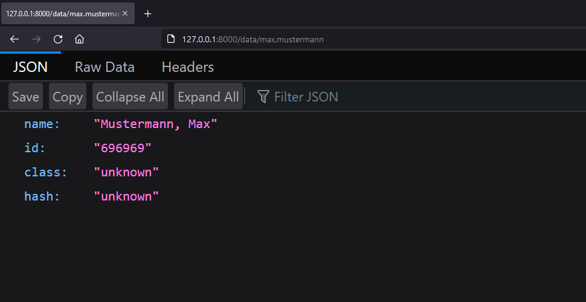

# Athene data

## Get

Get a users profile:
```bash
python athene data get <identifier>
```

Output:
```
<identifier>'s profile:
    Name: <name>
    Id: <id>
    ...
```

## Search

Search for a profile containing the given search term:
```bash
python athene data search <term>
```

## API

Launch an API containing all known data:
```bash
python athene data api <ip, default "127.0.0.1"> <port, default 8000>
```

Then, go to  \<ip\>:\<port\>/data/<identifier>, to receive a profile as JSON-data

